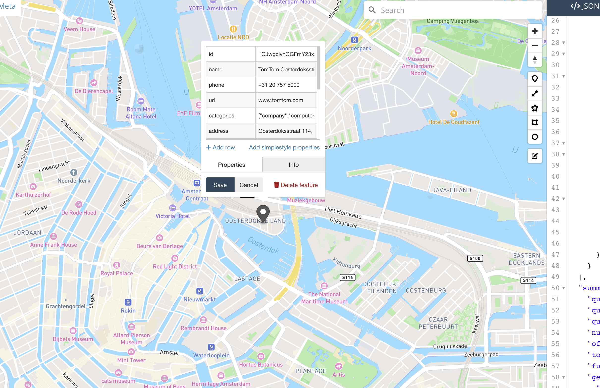

# TomTom Online Search Response Converter to Json
It is a concise and straightforward script designed to transform the response from TomTom's online search into GeoJson format. GeoJson is widely recognized as the industry standard for geographic information and is supported by numerous tools and libraries. Utilizing GeoJson can prove valuable for rapid development or when troubleshooting, making it a convenient and practical choice.

## How to use it?

The script is compatible with search responses obtained, for example using the following APIs :

1. Fuzzy search: For more details, refer to [https://developer.tomtom.com/search-api/documentation/search-service/fuzzy-search](https://developer.tomtom.com/search-api/documentation/search-service/fuzzy-search).

2. Geometry Search: More information can be found at [https://developer.tomtom.com/search-api/documentation/search-service/geometry-search](https://developer.tomtom.com/search-api/documentation/search-service/geometry-search).

3. Category Search: Explore further at [https://developer.tomtom.com/search-api/documentation/search-service/category-search](https://developer.tomtom.com/search-api/documentation/search-service/category-search).

4. Search Along route: Find additional documentation at [https://developer.tomtom.com/search-api/documentation/search-service/along-route-search](https://developer.tomtom.com/search-api/documentation/search-service/along-route-search).

For example, the following run of the script on the `geometrySearch` endpoint,

```sh
curl --silent --request POST \
  --url "https://api.tomtom.com/search/2/geometrySearch/.json?limit=20&lat=52.378075&lon=4.637921&language=en-GB&categorySet=7311&typeahead=true&timeZone=iana&key=${SEARCH_API_KEY}" \
  --header 'content-type: application/json; charset=utf-8' \
  --data '{"geometryList":[{"type":"CIRCLE","position":"52.378075,4.637921","radius":1000},{"type":"POLYGON","vertices":["52.37874,4.90482","52.37664,4.92559","52.37497,4.94877","52.36805,4.97246","52.34918,4.95993","52.34016,4.95169","52.32894,4.91392","52.34048,4.88611","52.33953,4.84388","52.37067,4.8432","52.38492,4.84663","52.40011,4.85058","52.38995,4.89075"]},{"type":"POLYGON","vertices":["52.466119,4.78833","52.466119,4.858571","52.430716,4.858571","52.430716,4.78833"]}]}' | ./tomtom-online-search-response-converter-geojson.sh | jq "."
```

or

the following run of the script on the `fuzzySearch` endpoint,

```
curl --silent --request GET \
  --url "https://api.tomtom.com/search/2/search/tomtom%20oosterdokstraat.json?lat=52.37317&lon=4.89066&key=${SEARCH_API_KEY}&language=en-GB&limit=1" | ./tomtom-online-search-response-converter-geojson.sh | jq "."
```

The above run on the `fuzzySearch` endpoint generates the following GeoJson output,
```json
{
  "type": "FeatureCollection",
  "features": [
    {
      "type": "Feature",
      "geometry": {
        "type": "Point",
        "coordinates": [
          4.908163,
          52.37615
        ]
      },
      "properties": {
        "id": "1QJwgclvnOGFmY23xymWmg",
        "name": "TomTom Oosterdoksstraat",
        "phone": "+31 20 757 5000",
        "url": "www.tomtom.com",
        "categories": [
          "company",
          "computer software"
        ],
        "address": "Oosterdoksstraat 114, 1011 DK Amsterdam",
        "streetName": "Oosterdoksstraat",
        "streetNumber": "114",
        "postalCode": "1011",
        "city": "Amsterdam",
        "country": "Netherlands",
        "entryPoints": [
          {
            "type": "main",
            "coordinates": [
              4.9082,
              52.37656
            ]
          }
        ],
        "viewport": {
          "topLeftPoint": [
            4.90669,
            52.37705
          ],
          "bottomRightPoint": [
            4.90964,
            52.37525
          ]
        }
      }
    }
  ],
  "summary": {
    "query": "tomtom oosterdokstraat",
    "queryType": "NON_NEAR",
    "queryTime": 136,
    "numResults": 1,
    "offset": 0,
    "totalResults": 93,
    "fuzzyLevel": 2,
    "geoBias": {
      "lat": 52.37317,
      "lon": 4.89066
    },
    "queryIntent": [],
    "geobiasCountry": "NL"
  }
}
```

Upon being rendered, it appears in the following manner.

